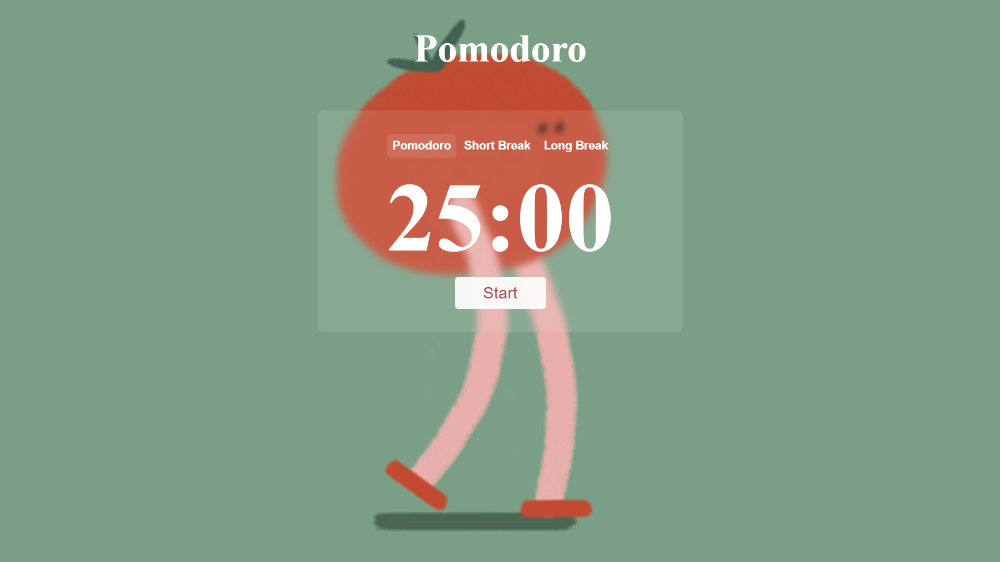

# Pomodoro Timer

A simple Pomodoro timer built with HTML, CSS, and JavaScript. This timer includes functionality for Pomodoro sessions, short breaks, and long breaks. It demonstrates basic timer operations and event handling in JavaScript.

## Features

- **Pomodoro Timer**: Set for 25 minutes by default.
- **Short Break**: Set for 5 minutes.
- **Long Break**: Set for 15 minutes.
- **Start/Reset Functionality**: Start the timer and reset it when needed.
- **Simple UI**: Basic interface with buttons for Pomodoro, short break, and long break.
- 
## Live Demo
You can view the live application here: [PomoDoro](https://pomo-doro-three.vercel.app/)

## Installation

1. **Clone the Repository**

   ```bash
   git clone https://github.com/hridayanshu236/PomoDoro.git

## Screenshots



